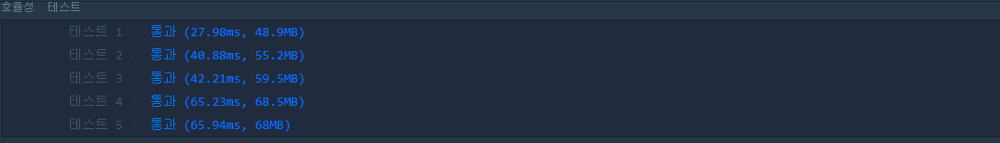

## 프로그래머스 완주하지 못한 선수.

_2020-10-10 작성_

참가한 마라톤 선수 중, 단 1명이 완주하지 못했습니다.
완주하지 못한 선수를 구하시오.(단, 동명이인이 존재할 수 있다.)

### 문제점

최초 코딩

```javascript
function solution(participants, completer) {
  let participantsList = {};
  for (let item of participants) {
    participantsList[item] = participantsList[item]
      ? participantsList[item] + 1
      : 1;
  }
  for (let item of completer) {
    participantsList[item]--;
  }
  for (let item in completerList) {
    if (completerList[item]) return person;
  }
}
```

- participantsList에서 completer를 제외하는 방식으로 코딩하였으므로 명단에 값이 남은 이름을 리턴해야 했으나, **남아있지 않은 이름을 리턴하였다**
- 긴장한 상황에서 혼동하지 않도록 **변수명을 직관적으로**, 혼란이 없도록 코딩 전에 간단히 논리와 각 변수를 정리할 것.

### 1차 수정

```javascript
function solution(participants, completer) {
  let notCompleter = {};
  for (let person of participants) {
    notCompleter[person] = notCompleter[person] ? notCompleter[person] + 1 : 1;
  }
  for (let person of completer) {
    notCompleter[person]--;
  }
  for (let person in completerList) {
    if (!completerList[person]) return person;
  }
}
```



- for 문의 사용을 줄이는 방법을 생각해 볼 것.
